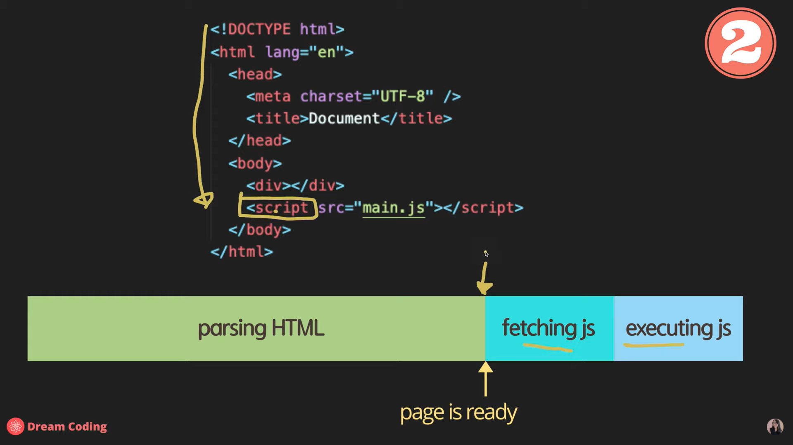

# Script Async와 Defer의 차이점 / use strict

Console API는 JavaScript에서 제공하는 API가 아닌 브라우저가 제공하고 이해하는 API다

그래서 node.js와 브라우저에서 사용할 수 있다

---

## Script 위치와 Async vs Defer

### Head


> 만약 JS 파일이 크다면 사용자가 웹사이트를 보는데 많은 시간이 소요될 것이다

### Body



> 서버에서 데이터를 받아오거나 DOM 요소를 조작하는 등 JS에 의존적인 사이트라면 정상적인 웹사이트 보는데 제약생김

### Head Async


> 병렬적으로 JS파일을 fetching하지만 HTML 파일이 Parsing 되기 전에 DOM 요소 조작한다면 문제 발생. 여전히 정상적인 웹사이트 보는데 시간 걸림.

### Head Defer


> 가장 적합한 방법.

### Head Async vs Head Defer

.png>)

> JS 파일이 순서에 의존적이라면 문제 발생

.png>)

> Fetching 후 순서대로 JS 파일 실행하기 때문에 가장 적합함

---

## Use Strict

Vanilla JavaScript로 작업시 파일 가장 상단에 `'use strict'` 선언해야한다

ECMAScript 5에 추가됨

JavaScipt는 매우 유연한 언어이고 이 때문에 위험한 언어이기도하다.

```js
a = 5;
```

> use strict 모드가 아니라면 에러가 발생하지않지만 use strict 모드를 선언하면 에러 발생

```js
'use strict';

let a;
a = 5;
```

> 에러를 없애기위해서 변수를 선언해야한다
