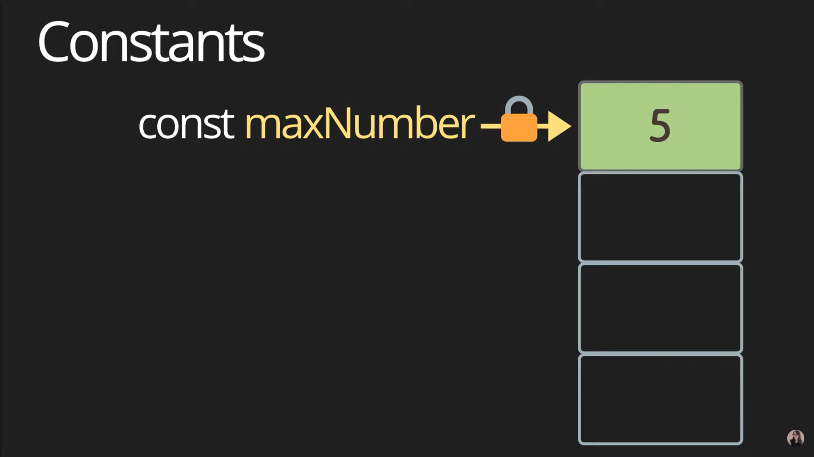

# Variable

## Let (added in ES6)

Mutable data type

```js
let name = 'ellie';
console.log(name);

name = 'haneul';
console.log(name);
```


> 시스템상의 한 메모리에 `let name`의 값인 `ellie`가 할당되고 다른 값으로 변경하면 그 메모리에 변경한 값이 들어간다

## Block Scope

```js
let globalName = 'Global Name';
{
  let name = 'ellie';
  console.log(name);
  name = 'haneul';
  console.log(name);
  console.log(globalName);
}

console.log(name); // 아무런 값도 출력하지 않음
console.log(globalName);
```

> global variable은 파일 시작부터 끝까지 메모리에 남아있기 때문에 사용 최소화하는 것이 중요

---

## Var (Don't ever use this!)

var hoisting : 선언 위치에 상관없이 제일 상단 위로 끌어올리는 것

var has no block scope

```js
{
  console.log(age); // undefined
  age = 4;
  console.log(age); // 4
  var age;
}

console.log(age); // 4
```

> 변수를 선언하기도 전에 값을 할당할 수 있고 사용 가능

---

## Constants

Immutable data type

- security
- thread safety : thread들이 동시에 값을 변경할 수 있는 것을 방지 가능
- reduce human mistakes



> 한 번 메모리에 할당된 이후에는 변경 불가능

```js
const daysOfWeek = 7;
const maxNumber = 5;
```

---

## Variable Types

- primitive : single Item (더 이상 쪼개어질 수 없는 작은 단위), number, string, boolean, null, symbol, undefined
- object
- function, first-class function

> first-class function : function도 변수에 할당 가능, 다른 함수의 인자로 전달 가능, return type으로도 가능하기 때문에 first-class function이라고 부른다

### Number - Infinity, -Infinity, NaN

```js
const count = 14; // number
const size = 16.2; // decimal number

console.log(`value:${count}, type:${typeof count}`);
console.log(`value:${size}, type:${typeof size}`);
```

```js
const infinity = 1 / 0;
const negativeInfinity = -1 / 0;
const nAn = 'not a number' / 1;

console.log(infinity);
console.log(negativeInfinity);
console.log(nAn);
```

### BigInt

```js
const bigInt = 123123123123123123n; // over (-2**53) ~ 2**53

console.log(`value:${bigInt}, type:${typeof bigInt}`);
```

### String

```js
const ellie = 'ellie';
const greeting = `Hello ${ellie}`; // template literals
console.log(`value:${greeting}, type:${typeof greeting}`);
```

### Boolean

- false : 0, null, undefiend, '', NaN
- true : any other value

```js
const canRead = true; // true
const test = 3 < 1; // false
const nothing = null; // null
let x; // undefined

console.log(`value:${canRead}, type:${typeof canRead}`);
console.log(`value:${test}, type:${typeof test}`);
console.log(`value:${nothing}, type:${typeof nothing}`);
console.log(`value:${x}, type:${typeof x}`);
```

### Symbol

```js
const symbol1 = Symbol('id');
const symbol2 = Symbol('id');

console.log(symbol1 === symbol2); // false

const symbol3 = Symbol.for('id');
const symbol4 = Symbol.for('id');

console.log(symbol3 === symbol4); // true

console.log(`value: ${symbol1.description}, type: ${typeof symbol1}`);
```

> `symbol`를 그대로 출력하면 Error 발생하기 때문에 `.description` 이용해서 string으로 변환 후 출력

### Object

data structure

```js
const ellie = { name: 'ellie', age: 42 };
ellie.age = 25;
console.log(ellie);
```


> `const ellie`는 잠겨있어서 다른 ref로 변경 불가능하지만 ref 안의 `name`, `age` 변수는 변경 가능

---

## Dynamic Typing : dynamically typed language

JS는 런타임 환경에서 type이 결정되어지기 때문에 에러가 발생할 경우가 많다 => TypeScript 출현!

```js
let text = 'hello';

console.log(text.charAt(0)); // h

text = '1' + 2;
console.log(text); // 12

text = '3' * '3';
console.log(text); // 9

console.log(text.charAt(0)); // Error
```
