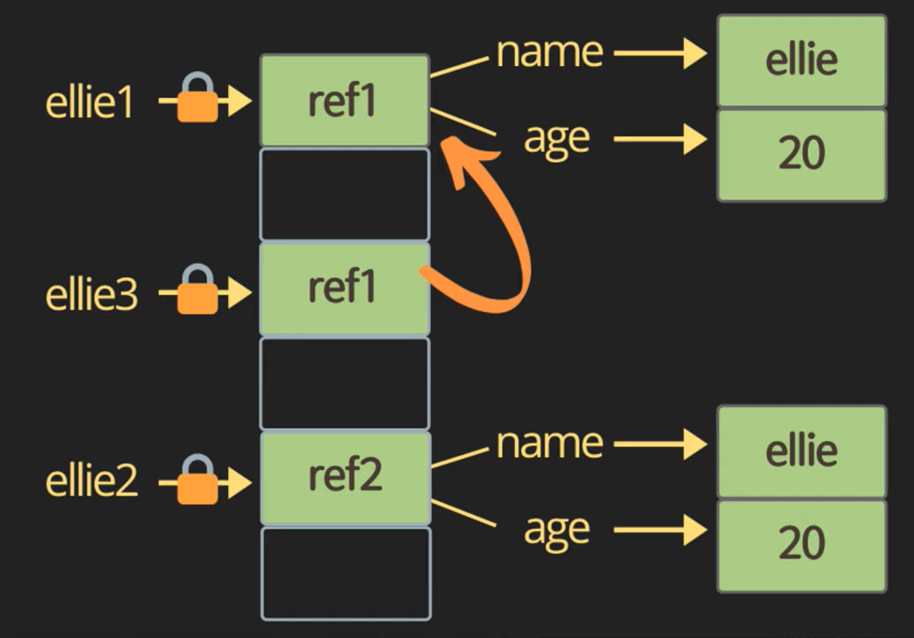

# Operator

## Increment and Decrement operators

```js
let counter = 1;

const preIncrement = ++counter;
// counter = counter + 1;
// preIncrement = coutner;
console.log(preIncrement, counter); // 2 2

const postIncrement = counter++;
// postIncrement = coutner;
// counter = counter + 1;
console.log(postIncrement, counter); // 2 3
```

---

## Assignment operators

```js
let x = 3;
let y = 6;

x += y; // x = x + y;
x -= y; // x = x - y;
```

---

## Logical operators : || (or), && (and), ! (not)

```js
const value1 = false;
const value2 = 4 < 2;

function check() {
  for (let i = 0; i < 10; i++) {
    // wasting time...
    console.log('🥲');
  }
  return true;
}

// || (or) : finds the first truthy value
// 하나라도 true면 true
console.log(`or: ${value1 || value2 || check()}`);

// && (and) : finds the first falsy value
// 하나라도 false면 fasle
console.log(`or: ${value1 && value2 && check()}`);
```

> expression 이나 `function`은 제일 마지막에 두는 것이 효율적!

### && (and) 사용 예시

- often used to compress long if-statement
- null check!
- nullableObject && nullableObject.something
- 아래 코드를 더 간결하게 표현할 때 사용

```js
if (nullableObject != null) {
  nullableObject.something;
}
```

### ! (not)

```js
console.log(!value1); // true
```

---

## Equality

```js
const stringFive = '5';
const numberFive = 5;

// == : loose equality, with type conversion(전환)
console.log(stringFive == numberFive); // true

// ===: strict equality, no type conversion
console.log(stringFive === numberFive); // false
```

> === : strict equality를 사용하는 것이 좋다

### Obect equality by reference

```js
const ellie1 = { name: 'ellie' };
const ellie2 = { name: 'ellie' };
const ellie3 = ellie1;

console.log(ellie1 == ellie2); // false
console.log(ellie1 === ellie2); // false
console.log(ellie1 === ellie3); // true
```



### Quiz

```js
console.log(0 == false); // true
console.log(0 === false); // false
console.log('' == false); // true
console.log('' === false); // false
console.log(null == undefined); // true
console.log(null === undefined); // false
```

---

## Conditional operators : if

if, else if, else

```js
const name = 'ellie';

if (name === 'ellie') {
  console.log('welcome ellie');
} else if (name === 'haneul') {
  console.log('welcome haneul');
} else {
  console.log('unknown');
}
```

---

## Ternary operator: ?

condition ? value1 : value2;

```js
const name = "ellie";
console.log(name === 'ellie' ? 'yes' : 'no'
```

> 간단할 때만 사용하자

---

## Switch statement

- use for multiple if checks
- use for enum-like value check
- use for multiple type checks in TS

```js
const browser = 'IE';

switch (browser) {
  case 'IE':
    console.log('hello IE');
    break;
  case 'Chrome':
  case 'Brave':
    console.log('hello google');
    break;
  default:
    console.log('Nothing');
    break;
}
```

---

## Loops

### while loop, while the condition is truthy, body code is executed

```js
let i = 3;

while (i > 0) {
  console.log(i);
  i--;
}
```

### do while loop, body code is executed first, then check the condition

```js
let i = 0;
do {
  console.log(i);
  i--;
} while (i > 0);
```

### for loop, for(begin; condition; step)

```js
/// let i = 3; : inline variable declaration
for (let i = 3; i > 0; i--) {
  console.log('Somethin');
}
```

### nested(중첩) loops

```js
for (let i = 0; i < 10; i++) {
  for (let j = 0; j < 10; j++) {
    console.log('somethinng');
  }
}
```

> Cpu에 좋지 않다. 되도록이면 이렇게 작성하는 것을 피하자

### Quiz

Q1. iterate from 0 to 10 and print only even numbers (use continue)

```js
for (let i = 0; i < 11; i++) {
  if (i % 2 !== 0) {
    continue;
  }
  console.log(i);
}
```

```js
for (let i = 0; i < 11; i++) {
  if (i % 2 === 0) {
    console.log(i);
  }
}
```

> `continue` 사용 없는 코드

Q2. iterate from 0 to 10 and print numbers until reaching 8 (use break)

```js
for (let i = 0; i < 11; i++) {
  if (i > 8) {
    break;
  }
  console.log(i);
}
```
